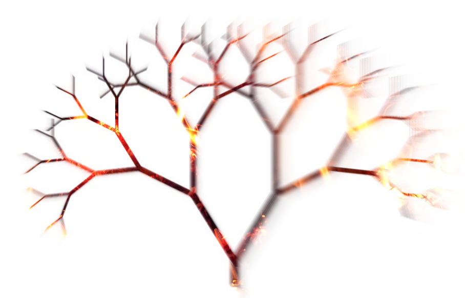

What is Brushfire?
=========

Brushfire is a framework developed at [Stripe](http://stripe.com) for distributed [supervised learning](https://en.wikipedia.org/wiki/Supervised_learning) of [decision trees](https://en.wikipedia.org/wiki/Decision_tree_learning) in [Scala](http://www.scala-lang.org/) using [ensemble models](https://en.wikipedia.org/wiki/Ensemble_learning).



# Quick start

Brushfire rides on Scala and [SBT](http://www.scala-sbt.org/) (Scala's interactive build tool). Get those installed and then we can run the example code which uses Brushfire to build example decision tree models from the [Iris dataset](https://archive.ics.uci.edu/ml/datasets/Iris). 

We can run it from your local machine (which pulls down all the required dependencies):

```bash
$ git clone https://github.com/stripe/brushfire.git
$ cd brushfire
$ ./quick-start
```

Or we can run it from a Hadoop cluster (which pulls down all the required dependencies except for Hadoop jars which are provided by the Hadoop execution environment):


```bash
$ git clone https://github.com/stripe/brushfire.git
$ cd brushfire
$ sbt brushfireScalding/assembly
$ cd example
$ ./iris
```

The `example/iris.output` directory will be created. Inside we can see 4 versions of a decision tree, represented as JSON, for classifying irises:

```bash
$ ls iris.output | grep step_*
step_00
step_01
step_02
step_03
```

Here's an example decision tree output from `step_03`:

```json
{
   "key":"petal-width",
   "predicate":{
      "lt":0.6015625
   },
   "left":{
      "leaf":0,
      "distribution":{
         "Iris-setosa":42
      }
   },
   "right":{
      "key":"petal-width",
      "predicate":{
         "lt":1.703125
      },
      "left":{
         "key":"petal-length",
         "predicate":{
            "lt":5.09375
         },
         "left":{
            "leaf":1,
            "distribution":{
               "Iris-virginica":1,
               "Iris-versicolor":38
            }
         },
         "right":{
            "leaf":2,
            "distribution":{
               "Iris-virginica":2
            }
         }
      },
      "right":{
         "key":"sepal-width",
         "predicate":{
            "lt":2.703125
         },
         "left":{
            "leaf":3,
            "distribution":{
               "Iris-virginica":4
            }
         },
         "right":{
            "leaf":4,
            "distribution":{
               "Iris-virginica":29
            }
         }
      }
   }
}
```

To use brushfire in your own SBT project, we add the following to our `build.sbt`:

```scala
libraryDependencies += "com.stripe" %% "brushfire" % "0.6.3"
```

To use brushfire as a jar in our own Maven project, we add the following to our POM file:

```xml
<dependency>
  <groupId>com.stripe</groupId>
  <artifactId>brushfire_${scala.binary.version}</artifactId>
  <version>0.6.3</version>
</dependency>
```

# Background

The basic approach to distributed tree learning is inspired by Google's [PLANET](http://static.googleusercontent.com/media/research.google.com/en/us/pubs/archive/36296.pdf), but considerably generalized thanks to Scala's type parameterization and [Algebird's](https://github.com/twitter/algebird) aggregation abstractions.

Brushfire currently supports:
* binary and multi-class classifiers
* numeric features (discrete and continuous)
* categorical features (including those with very high cardinality)
* k-fold cross validation and random forests
* chi-squared test as a measure of split quality
* feature importance and brier scores
* Scalding/Hadoop as a distributed computing platform

In the future we plan to add support for:
* regression trees
* CHAID-like multi-way splits
* error-based pruning
* many more ways to evaluate splits and trees
* Spark and single-node in-memory platforms

# Authors

Avi Bryant <http://twitter.com/avibryant> with assistance and contributions from:

* Edwin Chen <https://twitter.com/echen>
* Dan Frank <http://twitter.com/danielhfrank>
* Nathan Howell <https://twitter.com/nathanhowell>
* Roban Kramer <https://twitter.com/robanhk>
* Colin Marc <http://twitter.com/colinmarc>
* Steven Noble <http://twitter.com/snoble>
* Erik Osheim <http://twitter.com/d6>
* Tom Switzer <https://twitter.com/tixxit>


# Using Brushfire with Scalding

The only distributed computing platform that Brushfire currently supports is [Scalding](http://github.com/twitter/scalding), version 0.12 or later.

The simplest way to use Brushfire with Scalding is by subclassing [TrainerJob](http://stripe.github.io/brushfire/#com.stripe.brushfire.scalding.TrainerJob) and overriding `trainer` to return an instance of [Trainer](http://stripe.github.io/brushfire/#com.stripe.brushfire.scalding.Trainer). Example:

````scala
import com.stripe.brushfire._
import com.stripe.brushfire.scalding._
import com.twitter.scalding._

class MyJob(args: Args) extends TrainerJob(args) {
  import JsonInjections._

  def trainer = ???
}
```

You should import either `JsonInjections` or `KryoInjections` to specify serialization in either JSON or base64-encoded Kryo, respectively; the former has the advantage of being human readable, the latter is more efficient, which can be important for very large trees.

To construct a `Trainer`, you need to pass it training data as a Scalding `TypedPipe` of Brushfire [Instance[K, V,T]](http://stripe.github.io/brushfire/#com.stripe.brushfire.Instance) objects. `Instance` looks like this:

````scala
case class Instance[K, V, T](id: String, timestamp: Long, features: Map[K, V], target: T)
````

* The `id` should be unique for each instance.
* If there's an associated observation time, it should be the `timestamp`. (Otherwise `0L` is fine)
* `features` is a `Map` from feature name (type K, usually String) to some value of type V. There's built-in implicit support for `Int`, `Double`, `Boolean`, and `String` types (with the assumption for `Int` and `String` that there is a small, finite number of possible values). If, as is common, you need to mix different feature types, see the section on `Dispatched` below.
* the only built-in support for `target` currently is for `Map[L,Long]`, where `L` represents some label type (for example `Boolean` for a binary classifier or `String` for multi-class). The `Long` values represent the weight for the instance, which is usually 1.

Example:
````scala
Instance("AS-2014", 1416168857L, Map("lat" -> 49.2, "long" -> 37.1, "altitude" -> 35000.0), Map(true -> 1L))
````

You also need to pass it a [Sampler](http://stripe.github.io/brushfire/#com.stripe.brushfire.Sampler). Here are some samplers you might use:

* [SingleTreeSampler](http://stripe.github.io/brushfire/#com.stripe.brushfire.SingleTreeSampler$) will use the entirety of the training data to construct a single tree.
* [KFoldSampler(numTrees: Int)](http://stripe.github.io/brushfire/#com.stripe.brushfire.KFoldSampler) will construct k different trees, each excluding a random 1/k of the data, for use in cross-validation.
* [RFSampler(numTrees: Int, featureRate: Double, samplingRate: Double)](http://stripe.github.io/brushfire/#com.stripe.brushfire.RFSampler) will construct multiple trees, each using a separate bootstrap sample (using `samplingRate`, which defaults to `1.0`). Each node in the tree will also only consider a random `featureRate` sample of the features available. (This is the approach used for random forests).

One you have constructed a `Trainer`, you most likely want to call
`expandTimes(base: String, times: Int)`. This will build a new ensemble of trees
from the training data and expand them `times` times, to depth `times`. At each
step, the trees will be serialized to a directory (on HDFS, unless you're
running in local mode) under `base`.

Fuller example:
````scala
import com.stripe.brushfire._
import com.stripe.brushfire.scalding._
import com.twitter.scalding._

class MyJob(args: Args) extends TrainerJob(args) {
  import JsonInjections._

  def trainingData: TypedPipe[Instance[K, V,T]] = ???
  def trainer = Trainer(trainingData, KFoldSampler(4)).expandTimes(args("output"), 5)
}
````

#In Memory Expansion

Having expanded as deep as you want using the distributed algorithm, you may wish to ask for further, in-memory expansion of any nodes that are sufficiently small at this point by calling `expandSmallNodes(path: String, times: Int)`. By default, this will downsample every node to at most 10,000 instances of training data, and expand until they have fewer than 10 instances. You may need to tune this value, which you do by setting an implicit `Stopper`:

````scala
val implicit stopper = FrequencyStopper(10000, 10)
trainer.expandInMemory(args("output") + "/mem", 100)
```

Note that the distributed algorithm will *stop* expanding at the same instance count that the in-memory algorithm wants, ie, 10,000 instances by default.

# Dispatched

If you have mixed features, the recommended value type is `Dispatched[Int,String,Double,String]`, which requires your feature values to match any one of these four cases:

* `Ordinal(v: Int)` for numeric features with a reasonably small number of possible values
* `Nominal(v: String)` for categorical features with a reasonably small number of possible values
* `Continuous(v: Double)` for numeric features with a large or infinite number of possible values
* `Sparse(v: String)` for categorical features with a large or infinite number of possible values

Note that using `Sparse` and especially `Continuous` features will currently slow learning down considerably. (But on the other hand, if you try to use `Ordinal` or `Nominal` with a feature that has hundreds of thousands of unique values, it will be even slower, and then fail).

Example of a features map:

````scala
Map("age" -> Ordinal(35), "gender" -> Nominal("male"), "weight" -> Continuous(130.23), "name" -> Sparse("John"))
````

# Extending Brushfire

Brushfire is designed to be extremely pluggable. Some ways you might want to extend it are (from simplest to most involved):

* Adding a new sampling strategy, to get finer grained control over how instances are allocated to trees, or between the training set and the test set: define a new [Sampler](http://stripe.github.io/brushfire/#com.stripe.brushfire.Sampler)
* Add a new evaluation strategy (such as log-likelihood or entropy): define a new [Evaluator](http://stripe.github.io/brushfire/#com.stripe.brushfire.Evaluator)
* Adding a new feature type, or a new way of binning an existing feature type (such as log-binning real numbers): define a new [Splitter](http://stripe.github.io/brushfire/#com.stripe.brushfire.Splitter)
* Adding a new target type (such as real-valued targets for regression trees): define a new [Evaluator](http://stripe.github.io/brushfire/#com.stripe.brushfire.Evaluator), a new [Stopper](http://stripe.github.io/brushfire/#com.stripe.brushfire.Stopper) and quite likely also define a new [Splitter](http://stripe.github.io/brushfire/#com.stripe.brushfire.Splitter) for any continuous or sparse feature types you want to be able to use.
* Add a new distributed computation platform: define a new equivalent of [Trainer](http://stripe.github.io/brushfire/#com.stripe.brushfire.scalding.Trainer), idiomatically to the platform you're using. (There's no specific interface this should implement.)